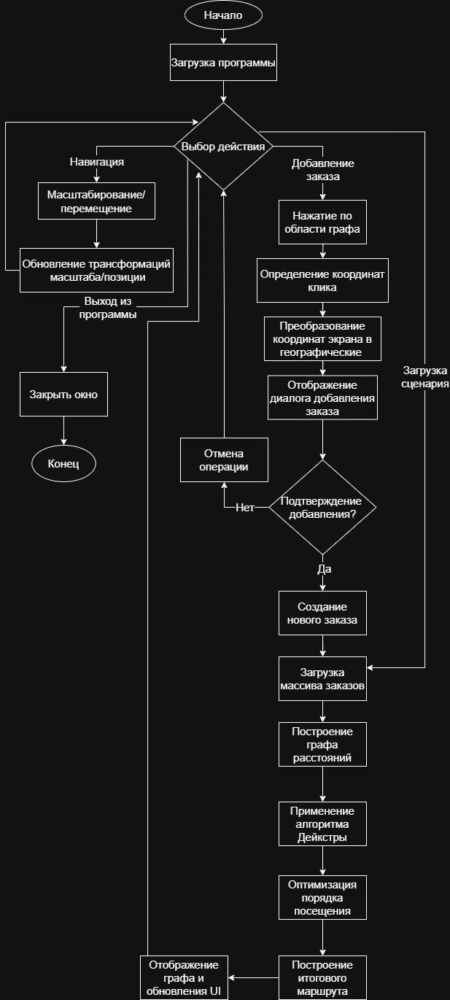

# DeliveryApp
# Документация по проекту
[1.1 Проблема](#твоё_название)

[1.2 Проблема](#Decision)

[1.3 Проблема](#AlgorithmDescription)

[1.4 Проблема](#Navigation)

## 1.1 Проблема

Традиционные подходы к оптимизации маршрутов (например, жадные алгоритмы или алгоритмы поиска кратчайшего пути на графах) неэффективны в динамично меняющихся условиях. Они либо не учитывают текущую дорожную обстановку, либо требуют перерасчета всего маршрута при каждом изменении, что приводит к задержкам и неэффективности.

## 1.2 Решение

Главной целью является минимизация общего времени доставки:

1. Представить дорожную сеть как взвешенный граф
2. Динамически оценивать веса ребер (время в пути), учитывая данные о трафике, авариях и погоде в реальном времени с помощью линейных преобразований
3. Использовать алгоритм Дейкстры для построения кратчайших путей между точками
4. Динамически обновлять дерево маршрутов, пересчитывая только части, затронутые изменениями (новые/отмененные заказы, изменение приоритета, дорожная обстановка)
5. Выбирать оптимальный путь из дерева с минимальной стоимостью (временем)


## 1.3 Описание используемого алгоритма
  
В приложении используется **алгоритм Дейкстры** для поиска кратчайших путей в графе. Алгоритм работает следующим образом:

### Принцип работы алгоритма Дейкстры:

1. **Инициализация**: Устанавливаем расстояние до начальной вершины равным 0, а до всех остальных - бесконечности
2. **Главный цикл**: Выбираем непосещенную вершину с минимальным расстоянием
3. **Релаксация**: Обновляем расстояния до всех соседних вершин, если найден более короткий путь
4. **Завершение**: Повторяем до тех пор, пока все вершины не будут посещены

### Комбинированный подход оптимизации:

Алгоритм основывается на двух основных компонентах:

- **Функция стоимости пути (g)**: Измеряет стоимость пути от начальной точки до текущей точки, рассчитанную через алгоритм Дейкстры
- **Эвристическая функция приоритета (h)**: Оценивает важность заказа на основе его приоритета

**Формула выбора следующей точки:**
```
Score = PriorityWeight × NormalizedPriority + DistanceWeight × NormalizedDistance
```

Где:
- `PriorityWeight = 0.6` (вес приоритета)
- `DistanceWeight = 0.4` (вес расстояния)

## 1.4 Навигация между экранами

Приложение состоит из следующих компонентов:

- **Главное окно**: Отображение графа маршрутов с возможностью масштабирования и панорамирования


- **Боковая панель**: Выбор предустановленных сценариев заказов
  


- **Диалог добавления заказа**: Интерактивное добавление новых точек доставки
  


- **Информационная панель**: Отображение стоимости маршрута и списка заказов
   


## 1.5 Блок-схема алгоритма приложения



## 1.6 Техническая документация по проекту

### 1.6.1 Класс MainWindow.cs

Главное окно приложения, наследуется от `Window` (WPF).

**Поля доступа private:**

| Поле | Описание |
|------|----------|
| `currentOrders` | Список текущих заказов (`List<Order>`) |
| `currentOrdersMass` | Массив текущих заказов (`Order[]`) |

**Методы доступа public/private:**

| Метод | Описание |
|-------|----------|
| `MainWindow()` | Конструктор, инициализирует интерфейс и обработчики зума/панорамирования |
| `LoadOrders(Order[] orders)` | Загружает заказы, вычисляет маршрут и обновляет интерфейс |
| `Array1_Click() ... Array6_Click()` | Обработчики кликов для загрузки предустановленных сценариев |
| `GraphContainer_RightClick()` | Обработчик правого клика для добавления новых заказов |
| `ToggleSidebar_Click()` | Показать боковую панель |
| `CloseSidebar_Click()` | Скрыть боковую панель |

### 1.6.2 Класс RouteHelper.cs

Статический класс для расчета оптимальных маршрутов.

**Константы:**

| Константа | Значение | Описание |
|-----------|----------|----------|
| `PriorityWeight` | 0.6 | Вес приоритета в формуле оптимизации |
| `DistanceWeight` | 0.4 | Вес расстояния в формуле оптимизации |

**Методы доступа public:**

| Метод | Описание |
|-------|----------|
| `FindOptimalRoute(Order[] orders)` | Основной метод поиска оптимального маршрута |

**Методы доступа private:**

| Метод | Описание |
|-------|----------|
| `BuildGraph(List<Point> points)` | Построение графа расстояний между всеми точками |
| `OptimizeVisitOrder()` | Оптимизация порядка посещения заказов |
| `Dijkstra()` | Реализация алгоритма Дейкстры для поиска кратчайших путей |
| `SelectNext()` | Выбор следующего заказа на основе комбинированной оценки |
| `Normalize()` | Нормализация значений для корректного сравнения |

### 1.6.3 Класс GraphDrawer.cs

Класс для отрисовки графа маршрутов на Canvas.

**Поля доступа private:**

| Поле | Описание |
|------|----------|
| `_canvas` | Ссылка на Canvas для отрисовки |
| `_transformer` | Преобразователь координат |

**Методы доступа public:**

| Метод | Описание |
|-------|----------|
| `GraphDrawer(Canvas, Order[])` | Конструктор |
| `DrawGraph(Order[], int[])` | Отрисовка графа с маршрутом |

**Методы доступа private:**

| Метод | Описание |
|-------|----------|
| `GetPriorityBrush(double priority)` | Получение цвета кисти в зависимости от приоритета |

### 1.6.4 Класс CoordinateTransformer.cs

Класс для преобразования географических координат в экранные.

**Поля доступа private:**

| Поле | Описание |
|------|----------|
| `minX, maxX, minY, maxY` | Границы координат |
| `scaleX, scaleY` | Коэффициенты масштабирования |

**Методы доступа public:**

| Метод | Описание |
|-------|----------|
| `CoordinateTransformer()` | Конструктор с расчетом параметров трансформации |
| `Transform(GeoPoint)` | Преобразование географических координат в экранные |
| `InverseTransform(WpfPoint)` | Обратное преобразование экранных координат в географические |

### 1.6.5 Класс AddPointWindow.cs

Диалоговое окно для добавления новых заказов.

**Поля доступа private:**

| Поле | Описание |
|------|----------|
| `x, y` | Координаты новой точки |
| `orders` | Массив существующих заказов |

**Свойства доступа public:**

| Свойство | Описание |
|----------|----------|
| `CreatedOrder` | Созданный заказ (результат диалога) |

**Методы доступа private:**

| Метод | Описание |
|-------|----------|
| `Add_Click()` | Обработчик подтверждения добавления заказа |
| `Cancel_Click()` | Обработчик отмены |

### 1.6.6 Класс ZoomPanHandler.cs

Статический класс для обработки масштабирования и панорамирования.

**Поля доступа private:**

| Поле | Описание |
|------|----------|
| `_lastMousePosition` | Последняя позиция мыши |
| `_isDragging` | Флаг перетаскивания |
| `_inertiaTimer` | Таймер для эффекта инерции |
| `_velocity` | Вектор скорости для инерции |

**Методы доступа public:**

| Метод | Описание |
|-------|----------|
| `Attach()` | Подключение обработчиков к Canvas |

**Методы доступа private:**

| Метод | Описание |
|-------|----------|
| `AnimateScale()` | Анимация масштабирования |


## 1.7 Структуры данных

### Order (из библиотеки BestDelivery)
```csharp
public class Order
{
    public int ID { get; set; }           // Уникальный идентификатор заказа
    public double Priority { get; set; }   // Приоритет заказа (0.0 - 1.0)
    public Point Destination { get; set; } // Координаты места доставки
}
```

### Point (из библиотеки BestDelivery)
```csharp
public class Point
{
    public double X { get; set; } // Координата X
    public double Y { get; set; } // Координата Y
}
```

## 1.8 Алгоритм работы системы

1. **Инициализация**: Загрузка начального набора заказов
2. **Построение графа**: Создание матрицы расстояний между всеми точками
3. **Применение Дейкстры**: Расчет кратчайших путей от склада до всех точек доставки
4. **Оптимизация порядка**: Выбор следующей точки на основе комбинированной оценки приоритета и расстояния
5. **Построение маршрута**: Формирование финального маршрута с возвратом на склад
6. **Визуализация**: Отображение графа с маршрутом, стрелками направления и весами ребер
<a name="твоё_название"></a>

